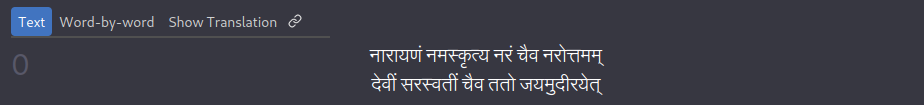
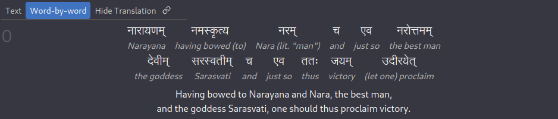

# Project Vyasa

## Table Of Contents

- [Introduction](#introduction)
  - [An Example](#an-example)
- [Contributing](#contributing)

## Introduction

Welcome to Project Vyasa!

The goal of this project is to provide a high-quality Sanskrit-English reader
for various Sanskrit texts in a modern web interface.

Many excellent resources are freely available online
(like [wisdomlib](https://www.wisdomlib.org/hinduism/book/)
and [Ambuda](https://ambuda.org/)!)
but I've yet to find one that has all the following properties:
- Word-by-word translation
- Detailed and accurate word-level grammatical explanation
- A minimal, easy-to-navigate, and clean web interface

It is *not* the aim to provide anything more than a literally correct translation;
that is, the included translations do not consider the broader cultural, historical,
and philosophical context of the text.

The public website is [currently hosted here](https://projectvyasa.gatsbyjs.io/).

### An Example

Without further ado, here's an example of what the final product looks like.
*Note that although the screenshots here use Devanagari exclusively, the frontend*
*is also capable of rendering IAST with the push of a button!*

Verse Text and Translation:

Word by word breakdown:

And finally, grammatical analysis in the form of a pop-out that appears on hover (or touch on mobile).
Each word is broken down into its roots, which can be clicked to go to the corresponding dictionary entry:

## Contributing

If you'd like to contribute to this project, there are several ways to do so;
See [CONTRIBUTING.md](./CONTRIBUTING.md) for details.