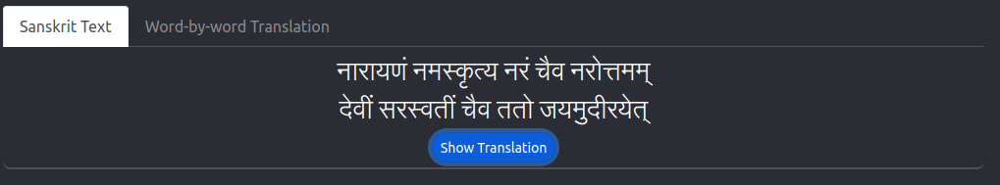
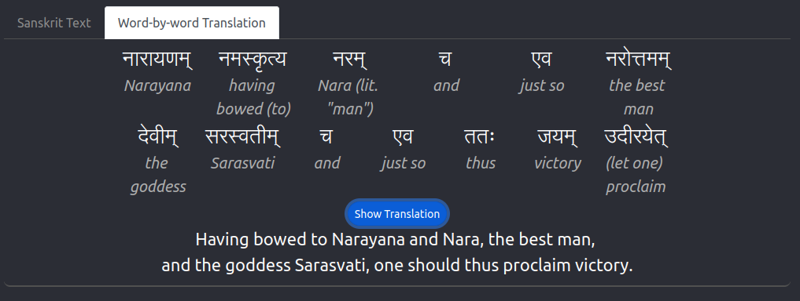
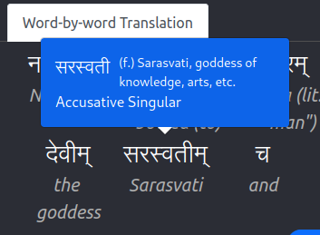

# Project Vyasa

## Table Of Contents

- [Introduction](#introduction)
  - [An Example](#an-example)
- [Set Up](#set-up)
- [Content Format](#content-format)
  - [Base Form](#base-form)
  - [Parts Of Speech](#parts-of-speech)
- [Dictionary Format](#dictionary-format)
- [Transliteration Methodology](#transliteration-methodology)


## Introduction

Welcome to Project Vyasa!

The goal of this project is to provide a high-quality Sanskrit-English reader 
for the Mahabharata in a modern web interface.

Many excellent resources are freely available online 
(like [wisdomlib](https://www.wisdomlib.org/hinduism/book/mahabharata-sanskrit)!)
but I've yet to find one that has all the following properties: 
- Word-by-word translation
- Detailed and accurate grammatical explanation with word-level granularity
- A minimal, easy-to-navigate, and clean web interface

Having stated the goal, it is equally important to mention that it is *not* the aim
of this project to provide anything more than a literally correct translation; 
for a translation that considers the broader cultural, historical, and philosophical 
context, you will need to look elsewhere!

### An Example

Without further ado, here's an example of what the final product looks like.
*Note that although the screenshots here use Devanagari exclusively, the frontend*
*is also capable of rendering IAST with the push of a button!*

Verse Text:



Word by word breakdown and translation:



And finally, grammatical analysis in the form of a pop-out that appears on hover:




## Set Up

To set up this repository for local development, you will need to:

1. [Install `npm`](https://docs.npmjs.com/downloading-and-installing-node-js-and-npm)

2. Install required packages:
  ```
  npm i
  ```

3. Install the Gatsby CLI client:
  ```
  npm i -g gatsby-cli
  ```

4. Launch the web server:
  ```
  make launch
  ```

At this point, you should be able to navigate to http://localhost:8000/ in your 
browser to view your local copy site.


## Content Format

The content for each chapter is stored in separate text file: `content/text/{book}/{chapter}.txt`.

The format of each file is:
```
<first verse number>-<last verse number>

word0 (base-form, parts of speech) literal translation
word1 (base-form, parts of speech) literal translation
...

<Translation>

word0 (base-form, parts of speech) literal translation
word1 (base-form, parts of speech) literal translation
...

<Translation>

... (more verses)
```

The format must conform to the following rules:

- Sections must be separated by a single blank line. 

- There must not be any blank lines within a section

- Each set of words belonging to a single verse must be grouped into a single section, 
  and the corresponding complete translation must be in a subsequent section.

- Each word of the verse text must appear on a separate line, in non-*sandhi*ed form
  and followed by its root, parts of speech, and a literal translation.

  The [`process_text.py`](./scripts/process_text.py) script can generate verse text with 
  *sandhi* applied based on the word-by-word input. As of this writing, the script only 
  handles the most common cases. Fortunately, adding new rules is easy! 
  Thus, if *sandhi* is not properly applied, the script will need to be updated.

- If the verse text needs to be split on more than one line, use a line containing a 
  single dash, `-`, to mark where the line break must be. For example:
  ```
  word0 (base-form, parts of speech) literal translation
  -
  word1 (base-form, parts of speech) literal translation
  ```

- Any Sanskrit text must use a special transliteration format that the front-end can 
  ingest and convert into either Devanagari or IAST. 
  See the [transliteration](#transliteration-methodology) section for details.

For example, consider the following example input text, given here in IAST:
```
nara gacchati
```

The corresponding content file would look like this:
```
nara (nara, nom sing) man
gacchati (!gam, 3 sing pres act ind) goes

The man goes.
```
*Note: although it looks similar in this case, this transliteration format is* not *IAST!*

More detail on the fields in parentheses is provided in the following sections.

### Base Form

The `"base-form"` field should be either the verbal root or noun stem (depending on the word) 
written in our [special transliteration format](#transliteration-methodology).
Some common syntax rules to consider:

- Compounds must be split using plus signs, i.e. `+`. For example: `bahu+vriihi`.
  This allows the frontend to split them up and provide definitions for each consituent word
  in a pop-out bubble.

- Verbal roots should be prefixed with an exclamation mark, i.e. `!`. For example: `!gam`.

- Pre-verbs must be separated from their roots by dashes, i.e. `-`. For example: `ava-!gam`.

### Parts Of Speech

The `"parts of speech"` field is order invariant and must be provided in 
abbreviated form as a space-separated list. 
Valid entries are as follows:

- `nom/voc/acc/inst/dat/abl/gen/loc`: Nominative/Vocative/Accusative/Instrumental/Dative/Ablative/Genitive/Locative case
- `1/2/3`: 1st/2nd/3rd person
- `sing/du/pl`: Singular/Dual/Plural number
- `pres/perf/imp/fut`: Present/Perfect/Imperfect/Future tense
- `act/pass/mid`: Active/Passive/Middle voice
- `caus/des`: Causative/Desiderative
- `ind/pot`: Indicative/Potential mood
- `abs`: Absolutive
- `part`: Participle


## Dictionary Format

This project also includes a miniature (as of this writing) dictionary. 
The dictionary format is:
```
word (detail) [meanings...]
... (more words)
```

The `detail` field is only required for the following types:
- Adjectives. For example: `uttama (adj) highest, best`
- Indeclinables. For example: `ca (indc) and`
- Nouns, to specify gender. For example: `nara (m) man`.
  Multiple genders may be specified, in which case they should 
  be concatenated, e.g. `mn`. 

Additionally, as in the main content text, verbal roots should be prefixed 
with an exclamation mark, i.e. `!`.

An example file may look like:
```
namas-!kr> to bow, to pay homage
nara (m) man
```


## Transliteration Methodology

The goal of the special transliteration format used here is to be friendly 
to English keyboards and quick to type. The general principles are:

- Double a vowel to lengthen it: `i` -> `इ/i`, `ii` -> `ई/ī`.
- Compound vowels are preserved in their original form: `ai` -> `ए/e`.
  This is a departure from typical conventions but makes it easier to 
  break and/or apply *sandhi*.
- `>` indicates vocalic sounds: `r` -> `र्/r` but `r>` -> `ऋ/ṛ`
- `^` indicates velar sounds: `n` -> `न्/n` but `n^` -> `ङ्/ṅ`
- `~` indicates palatal sounds: `s` -> `स्/s` but `s~` -> `श्/ś`
- `<` indicates retroflex sounds: `t` -> `त्/t` but `t<` -> `ट्/ṭ`
- Special symbols include:
  - `.` which maps to anusvara, i.e. `ं/ṃ`
  - `'` which maps to avagraha, i.e. `ऽ/'`
  - `:` which maps to visarga, i.e. `ः/ḥ`

The specifics of the format can be found under 
[`content/raw/transliteration_rulesets/`](./content/raw/transliteration_rulesets/)